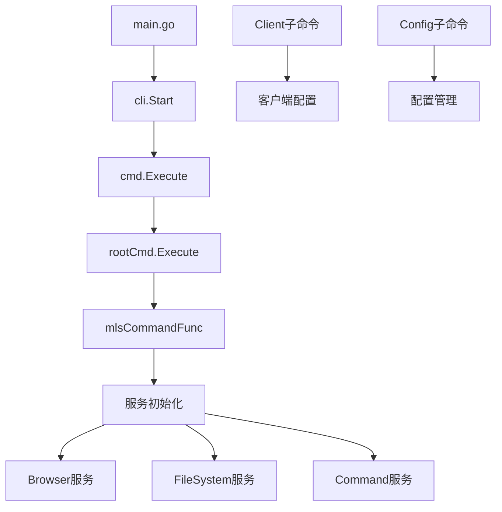
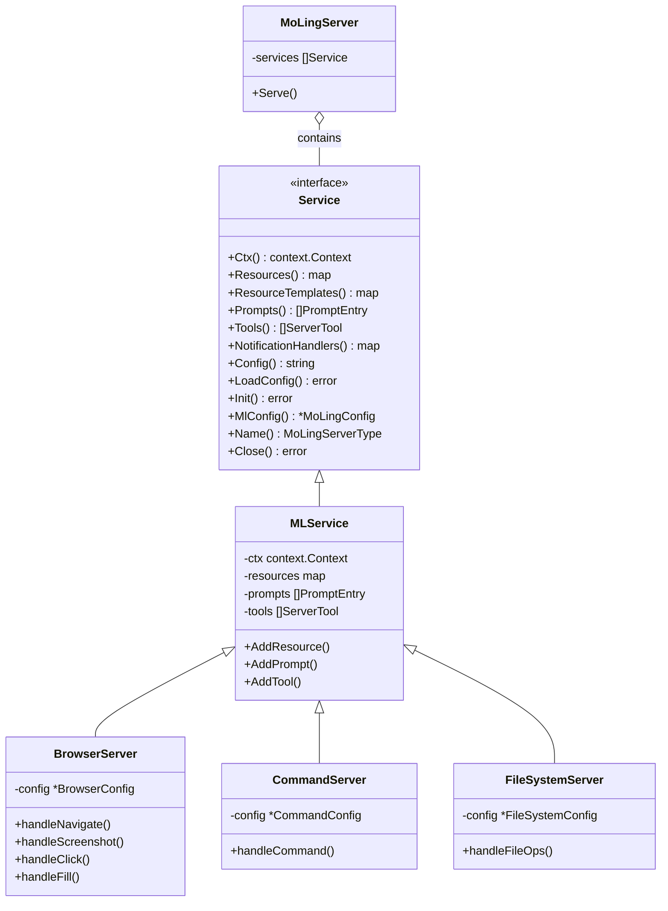
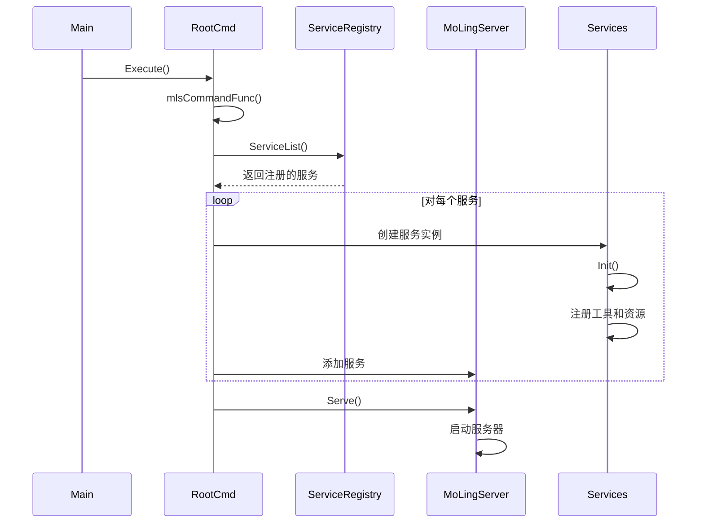
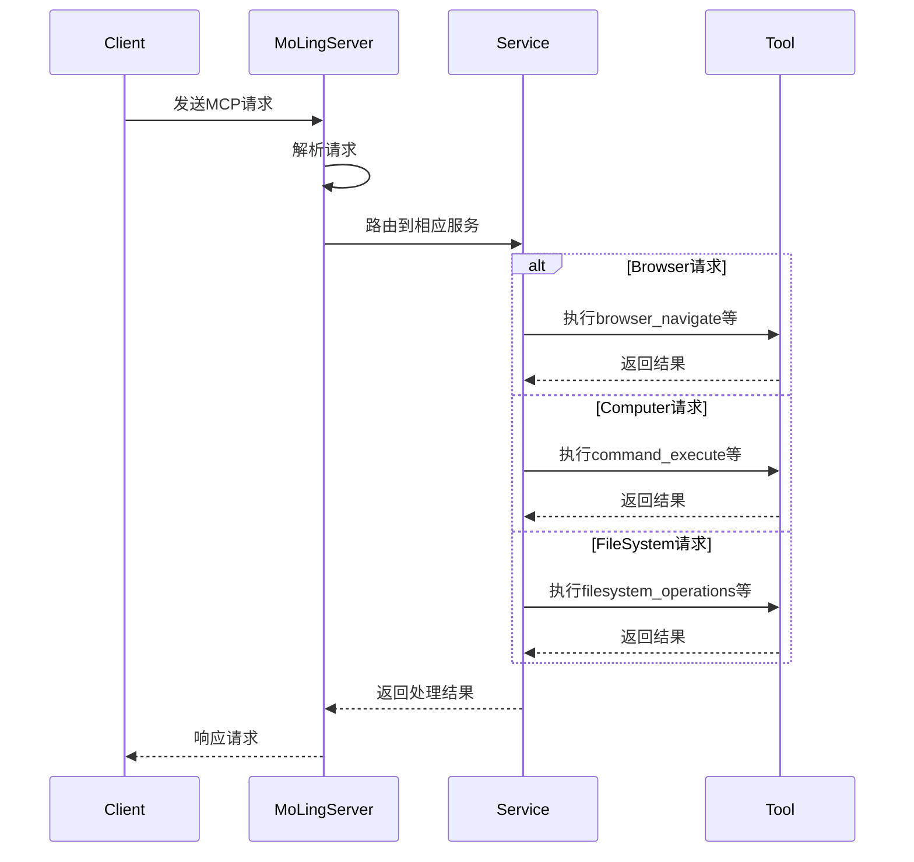
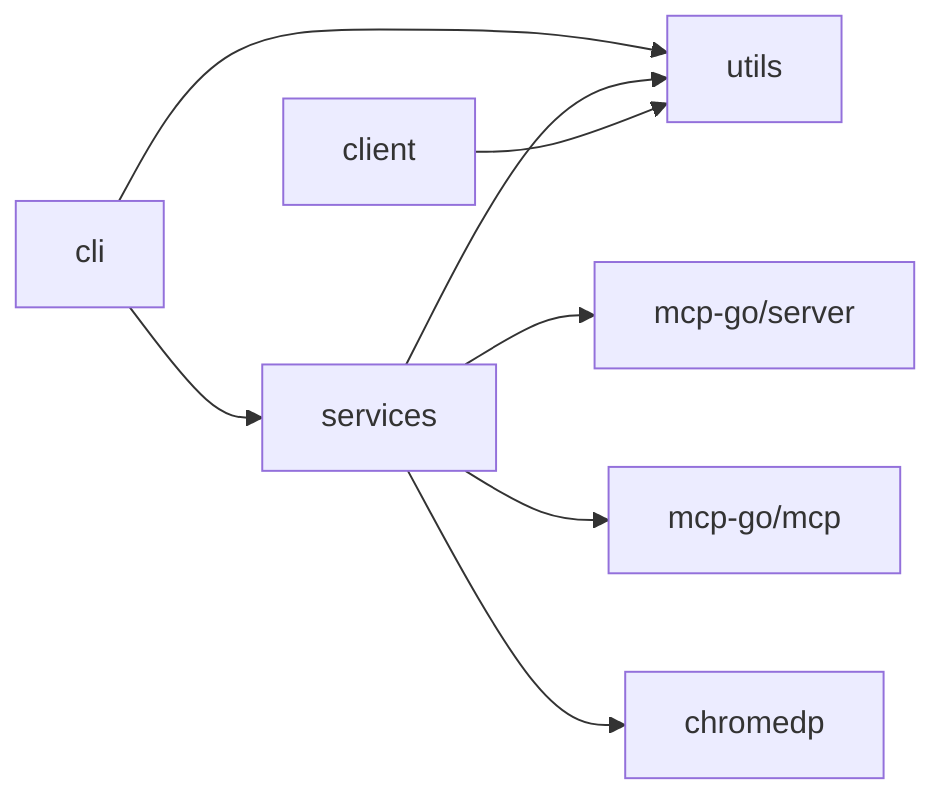

# MoLing项目架构分析

MoLing是一个基于computer-use和browser-use的MCP服务器，提供本地部署、无依赖的办公AI助手功能。本文档基于项目代码分析其架构设计。

## 项目结构



### 代码示例：启动流程

**主入口 (main.go)**
```go
package main

import "github.com/gojue/moling/cli"

func main() {
	cli.Start()
}
```

**CLI启动 (cli/main.go)**
```go
package cli

import (
	"github.com/gojue/moling/cli/cmd"
)

func Start() {
	cmd.Execute()
}
```

**命令执行 (cli/cmd/root.go)**
```go
func Execute() {
	rootCmd.SetUsageFunc(usageFunc)
	rootCmd.SetHelpTemplate(`{{.UsageString}}`)
	rootCmd.CompletionOptions.DisableDefaultCmd = true
	rootCmd.Version = GitVersion
	rootCmd.SetVersionTemplate(`{{with .Name}}{{printf "%s " .}}{{end}}{{printf "version:\t%s" .Version}}
`)
	err := rootCmd.Execute()
	if err != nil {
		os.Exit(1)
	}
}
```

**服务初始化 (cli/cmd/root.go)**
```go
func mlsCommandFunc(command *cobra.Command, args []string) error {
	// 初始化日志
	loger := initLogger(mlConfig.BasePath)
	mlConfig.SetLogger(loger)
	
	// 加载服务列表
	var modules []string
	if mlConfig.Module != "all" {
		modules = strings.Split(mlConfig.Module, ",")
	}
	var srvs []services.Service
	for srvName, nsv := range services.ServiceList() {
		if len(modules) > 0 {
			if !utils.StringInSlice(string(srvName), modules) {
				continue
			}
		}
		// 创建服务实例并初始化
		srv, err := nsv(ctxNew)
		if err != nil {
			loger.Error().Err(err).Msgf("failed to create service %s", srv.Name())
			break
		}
		// 执行服务初始化
		err = srv.Init()
		if err != nil {
			loger.Error().Err(err).Msgf("failed to init service %s", srv.Name())
			break
		}
		srvs = append(srvs, srv)
	}
	// 创建MCP服务器并启动
	srv, err := services.NewMoLingServer(ctxNew, srvs, *mlConfig)
	if err != nil {
		loger.Error().Err(err).Msg("failed to create server")
		return err
	}
	go func() {
		err = srv.Serve()
		if err != nil {
			loger.Error().Err(err).Msg("failed to start server")
			return
		}
	}()
	// 处理信号和退出...
}
```

## 核心组件关系



### 代码示例：核心接口和实现

**Service接口定义 (services/service.go)**
```go
type Service interface {
	Ctx() context.Context
	// Resources returns a map of resources and their corresponding handler functions.
	Resources() map[mcp.Resource]server.ResourceHandlerFunc
	// ResourceTemplates returns a map of resource templates and their corresponding handler functions.
	ResourceTemplates() map[mcp.ResourceTemplate]server.ResourceTemplateHandlerFunc
	// Prompts returns a map of prompts and their corresponding handler functions.
	Prompts() []PromptEntry
	// Tools returns a slice of server tools.
	Tools() []server.ServerTool
	// NotificationHandlers returns a map of notification handlers.
	NotificationHandlers() map[string]server.NotificationHandlerFunc

	// Config returns the configuration of the service as a string.
	Config() string
	// LoadConfig loads the configuration for the service from a map.
	LoadConfig(jsonData map[string]interface{}) error

	// Init initializes the service with the given context and configuration.
	Init() error

	MlConfig() *MoLingConfig

	// Name returns the name of the service.
	Name() MoLingServerType

	// Close closes the service and releases any resources it holds.
	Close() error
}
```

**MLService基础实现 (services/service.go)**
```go
// MLService implements the Service interface and provides methods to manage resources, templates, prompts, tools, and notification handlers.
type MLService struct {
	ctx                  context.Context
	lock                 *sync.Mutex
	resources            map[mcp.Resource]server.ResourceHandlerFunc
	resourcesTemplates   map[mcp.ResourceTemplate]server.ResourceTemplateHandlerFunc
	prompts              []PromptEntry
	tools                []server.ServerTool
	notificationHandlers map[string]server.NotificationHandlerFunc
	logger               zerolog.Logger // The logger for the service
	mlConfig             *MoLingConfig  // The configuration for the service
}
```

**Browser服务实现示例 (services/browser.go)**
```go
// BrowserServer represents the configuration for the browser service.
type BrowserServer struct {
	MLService
	config       *BrowserConfig
	name         string // The name of the service
	cancelAlloc  context.CancelFunc
	cancelChrome context.CancelFunc
}

func (bs *BrowserServer) Init() error {
	// ...
	bs.AddTool(mcp.NewTool(
		"browser_navigate",
		mcp.WithDescription("Navigate to a URL"),
		mcp.WithString("url",
			mcp.Description("URL to navigate to"),
			mcp.Required(),
		),
	), bs.handleNavigate)
	bs.AddTool(mcp.NewTool(
		"browser_screenshot",
		mcp.WithDescription("Take a screenshot of the current page or a specific element"),
		// ...
	), bs.handleScreenshot)
	// 注册更多工具...
	return nil
}
```

**MoLingServer服务器实现 (services/moling.go)**
```go
type MoLingServer struct {
	ctx        context.Context
	server     *server.MCPServer
	services   []Service
	logger     zerolog.Logger
	mlConfig   MoLingConfig
	listenAddr string // SSE mode listen address, if empty, use STDIO mode.
}

func (m *MoLingServer) loadService(srv Service) error {
	// Add resources
	for r, rhf := range srv.Resources() {
		m.server.AddResource(r, rhf)
	}
	// Add Resource Templates
	for rt, rthf := range srv.ResourceTemplates() {
		m.server.AddResourceTemplate(rt, rthf)
	}
	// Add Tools
	m.server.AddTools(srv.Tools()...)
	// Add Notification Handlers
	for n, nhf := range srv.NotificationHandlers() {
		m.server.AddNotificationHandler(n, nhf)
	}
	// Add Prompts
	for _, pe := range srv.Prompts() {
		// Add Prompt
		m.server.AddPrompt(pe.Prompt(), pe.Handler())
	}
	return nil
}

func (s *MoLingServer) Serve() error {
	// 启动服务器
	if s.listenAddr != "" {
		// SSE模式
		return server.NewSSEServer(s.server, server.WithBaseURL(ltnAddr)).Start(s.listenAddr)
	}
	// STDIO模式
	return server.ServeStdio(s.server, server.WithErrorLogger(mLogger))
}
```

## 服务注册与初始化流程



### 代码示例：服务注册与初始化

**服务注册 (services/register.go)**
```go
var serviceLists = make(map[MoLingServerType]func(ctx context.Context) (Service, error))

// RegisterServ register service
func RegisterServ(n MoLingServerType, f func(ctx context.Context) (Service, error)) {
	serviceLists[n] = f
}

// ServiceList  get service lists
func ServiceList() map[MoLingServerType]func(ctx context.Context) (Service, error) {
	return serviceLists
}
```

**服务自注册 (services/browser.go, services/command.go, services/file_system.go)**
```go
// 在browser.go中
func init() {
	RegisterServ(BrowserServerName, NewBrowserServer)
}

// 在command.go中 
func init() {
	RegisterServ(CommandServerName, NewCommandServer)
}

// 在file_system.go中
func init() {
	RegisterServ(FilesystemServerName, NewFilesystemServer)
}
```

**服务初始化与加载 (cli/cmd/root.go)**
```go
// 服务初始化部分已在前面展示，这里展示MoLingServer的创建和启动
srv, err := services.NewMoLingServer(ctxNew, srvs, *mlConfig)
if err != nil {
	loger.Error().Err(err).Msg("failed to create server")
	return err
}
go func() {
	err = srv.Serve()
	if err != nil {
		loger.Error().Err(err).Msg("failed to start server")
		return
	}
}()
```

## MCP请求处理流程



### 代码示例：请求处理

**Browser服务处理导航请求示例 (services/browser.go)**
```go
func (bs *BrowserServer) handleNavigate(ctx context.Context, request mcp.CallToolRequest) (*mcp.CallToolResult, error) {
	url, ok := request.Params.Arguments["url"].(string)
	if !ok {
		return mcp.NewToolResultError("url must be a string"), nil
	}

	runCtx, cancelFunc := context.WithTimeout(bs.ctx, time.Duration(bs.config.NavigateTimeout)*time.Second)
	defer cancelFunc()
	err := chromedp.Run(runCtx, chromedp.Navigate(url))
	if err != nil {
		return mcp.NewToolResultError(fmt.Errorf("failed to navigate: %v", err).Error()), nil
	}
	return mcp.NewToolResultText(fmt.Sprintf("Successfully navigated to %s", url)), nil
}
```

**Command服务执行命令示例 (services/command.go)**
```go
func (cs *CommandServer) handleExecuteCommand(ctx context.Context, request mcp.CallToolRequest) (*mcp.CallToolResult, error) {
	command, ok := request.Params.Arguments["command"].(string)
	if !ok {
		return mcp.NewToolResultError(fmt.Errorf("command must be a string").Error()), nil
	}

	// Check if the command is allowed
	if !cs.isAllowedCommand(command) {
		cs.logger.Err(ErrCommandNotAllowed).Str("command", command).Msgf("If you want to allow this command, add it to %s", filepath.Join(cs.MlConfig().BasePath, "config", cs.MlConfig().ConfigFile))
		return mcp.NewToolResultError(fmt.Sprintf("Error: Command '%s' is not allowed", command)), nil
	}

	// Execute the command
	output, err := ExecCommand(command)
	if err != nil {
		return mcp.NewToolResultError(fmt.Sprintf("Error executing command: %v", err)), nil
	}

	return mcp.NewToolResultText(output), nil
}
```

**FileSystem服务读取文件示例 (services/file_system.go)**
```go
func (fs *FilesystemServer) handleReadFile(ctx context.Context, request mcp.CallToolRequest) (*mcp.CallToolResult, error) {
	// 获取请求参数
	path, ok := request.Params.Arguments["path"].(string)
	if !ok {
		return mcp.NewToolResultError("path must be a string"), nil
	}

	// 验证路径
	absPath, err := fs.validatePath(path)
	if err != nil {
		return mcp.NewToolResultError(fmt.Sprintf("Invalid path: %v", err)), nil
	}

	// 检查文件是否存在
	if _, err := os.Stat(absPath); os.IsNotExist(err) {
		return mcp.NewToolResultError(fmt.Sprintf("File not found: %s", path)), nil
	}

	// 读取文件内容
	content, err := os.ReadFile(absPath)
	if err != nil {
		return mcp.NewToolResultError(fmt.Sprintf("Error reading file: %v", err)), nil
	}

	// 根据文件大小决定返回方式
	if len(content) <= MaxInlineSize {
		return mcp.NewToolResultText(string(content)), nil
	} else {
		// 处理大文件...
	}
}
```

## 模块依赖关系



### 代码示例：关键依赖

**MCP相关依赖**
```go
import (
	"github.com/mark3labs/mcp-go/mcp"
	"github.com/mark3labs/mcp-go/server"
)
```

**Browser服务的ChromeDP依赖**
```go
import (
	"github.com/chromedp/chromedp"
)
```

**内部模块依赖**
```go
import (
	"github.com/gojue/moling/services"
	"github.com/gojue/moling/utils"
	"github.com/gojue/moling/cli/cmd"
)
```

## 总结

MoLing项目采用模块化设计，以服务为中心的架构。核心是MCP服务器，通过服务注册机制动态加载不同功能模块。主要包括三类服务：

1. **Browser服务** - 提供浏览器控制能力，支持导航、截图、点击等操作
2. **Command服务** - 提供系统命令执行能力
3. **FileSystem服务** - 提供文件系统操作能力

项目通过Cobra框架实现命令行接口，支持不同的运行模式和配置选项。服务之间通过接口解耦，便于扩展和维护。

服务注册与初始化流程清晰，通过`init()`函数进行自注册，运行时根据配置动态加载所需服务。MCP请求处理采用工具（Tool）和资源（Resource）模型，使AI能够方便地调用系统和浏览器功能。 