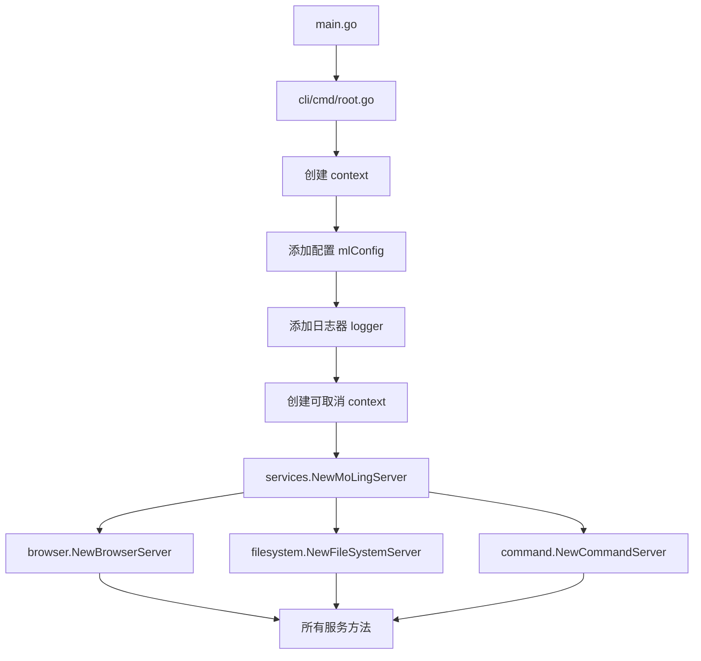
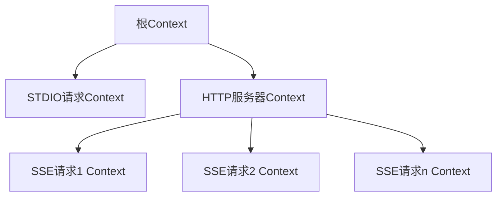

# MoLing 项目中的 Context 使用分析

本文档详细分析 MoLing 项目中 Go 语言 `context` 包的使用情况，包括其存储、传递、使用参数的方式，以及这种方式的优缺点。

## 概述

在 MoLing 项目中，`context` 包主要用于：

1. 存储全局配置（`MoLingConfig`）
2. 存储日志记录器（`zerolog.Logger`）
3. 实现服务的可控终止（通过 `context.WithCancel`）

## Context 键的定义

```go
type contextKey string

// MoLingConfigKey is a context key for storing the version of MoLing
const (
    MoLingConfigKey contextKey = "moling_config"
    MoLingLoggerKey contextKey = "moling_logger"
)
```

这两个键分别用于在 context 中存储 MoLing 的配置信息和日志记录器。

## Context 的创建和传递流程

### 1. 创建过程

在 `cli/cmd/root.go` 中，context 的创建通常遵循以下三步流程：

```go
// 1. 创建包含配置信息的基础 context
ctx := context.WithValue(context.Background(), services.MoLingConfigKey, mlConfig)

// 2. 向 context 添加日志记录器
ctx = context.WithValue(ctx, services.MoLingLoggerKey, loger)

// 3. 创建可取消的 context
ctxNew, cancelFunc := context.WithCancel(ctx)
```

### 2. 传递过程

创建后的 context 会传递给各个服务：



### 3. 使用方式

各服务通过 `ctx.Value()` 方法提取配置和日志记录器：

```go
// 提取配置
globalConf := ctx.Value(MoLingConfigKey).(*MoLingConfig)

// 提取日志记录器
logger, ok := ctx.Value(MoLingLoggerKey).(zerolog.Logger)
if !ok {
    return nil, fmt.Errorf("invalid logger type: %T", ctx.Value(MoLingLoggerKey))
}
```

## Context 取消机制的使用

在 MoLing 项目中，context 的取消机制主要用于：

1. 优雅关闭服务
2. 处理超时和中断

```go
// 创建可取消的 context
ctxNew, cancelFunc := context.WithCancel(ctx)

// 在收到信号（如 SIGINT、SIGTERM）时取消 context
sigChan := make(chan os.Signal, 2)
signal.Notify(sigChan, syscall.SIGINT, syscall.SIGTERM)
_ = <-sigChan
cancelFunc() // 取消 context
```

各个服务可以监听 context 的取消信号来进行清理工作：

```go
// 伪代码示例
func (s *Service) someOperation() {
    select {
    case <-s.ctx.Done():
        // 进行清理工作
        return
    default:
        // 正常操作
    }
}
```

## 使用 Context 传递参数的好处

1. **生命周期管理**：通过 `context.WithCancel` 可以创建能被取消的 context，当调用 `cancelFunc()` 时，所有使用该 context 的 goroutine 都能感知到取消信号。

2. **参数隔离**：各个服务只能访问到 context 中存储的值，而不是直接访问全局变量，这提高了代码的模块化程度。

3. **显式依赖**：context 作为参数传递，使得函数的依赖关系更加清晰。

4. **并发安全**：context 的不可变性设计使得其在并发环境下是安全的。

5. **统一接口**：Go 标准库和第三方库普遍支持 context，使用 context 可以更好地与这些库集成。

6. **请求追踪**：可以在 context 中添加请求 ID 等信息，方便日志追踪。

## 使用 Context 传递参数的缺点

1. **类型安全问题**：context.Value 返回的是 interface{}，需要类型断言，可能导致运行时错误。如代码所示，每次使用 Value 都需要进行类型检查：

```go
logger, ok := ctx.Value(MoLingLoggerKey).(zerolog.Logger)
if !ok {
    return nil, fmt.Errorf("invalid logger type: %T", ctx.Value(MoLingLoggerKey))
}
```

2. **隐式依赖**：虽然比全局变量更好，但依然存在隐式依赖问题。代码中并没有明确表明函数依赖哪些 context 值。

3. **性能开销**：每次 `ctx.Value()` 调用都会遍历整个 context 链，在性能敏感的场景下可能有影响。

4. **命名冲突风险**：使用字符串作为键可能导致不同包之间的命名冲突。MoLing 通过定义自定义类型 `contextKey` 降低了这种风险。

## 命令行工具场景下的选择：Context vs 全局包

MoLing 作为一个需要打包为可执行文件的命令行工具，选择使用 context 还是全局包需要考虑以下几个因素：

### MoLing 的特殊性

MoLing 虽然是命令行工具，但它实际上是一个 MCP（MoLing Computer Protocol）服务器，具有以下特点：

1. **长期运行**：作为服务器，MoLing 可能会长时间运行，而不是执行完单个命令就退出
2. **多服务管理**：管理多个服务（Browser、FileSystem、Command 等）
3. **需要优雅关闭**：需要在接收到信号时优雅地关闭所有服务

从源码分析可以看到，MoLing 有以下场景适合使用 context：

```go
// 在 root.go 中监听信号并触发关闭
sigChan := make(chan os.Signal, 2)
signal.Notify(sigChan, syscall.SIGINT, syscall.SIGTERM)
_ = <-sigChan
loger.Info().Msg("Received signal, shutting down...")
cancelFunc() // 取消 context
```

```go
// 在 browser_debugger.go 中创建子 context 用于特定操作
rctx, cancel := context.WithCancel(bs.ctx)
```

### 对比分析

针对 MoLing 这类命令行工具，context 和全局包各有优劣：

#### 全局包方式（如 `conf.GetCfg()`, `slog.Info()`）

**优势：**
1. **简化代码**：不需要在函数间传递 context，代码更简洁
2. **使用便捷**：在任何地方都可以直接访问配置和日志
3. **适合简单工具**：对于单一功能的小型命令行工具，全局包方式足够简单有效

**劣势：**
1. **难以管理服务生命周期**：全局方式难以实现优雅关闭机制
2. **不利于多服务协同**：MoLing 管理多个服务，全局变量难以控制不同服务的状态
3. **信号传递困难**：无法像 context 那样方便地传递取消信号

#### Context 方式（当前实现）

**优势：**
1. **生命周期管理**：特别适合需要优雅关闭的长期运行服务
2. **服务隔离**：各服务在自己的上下文中运行，降低耦合
3. **取消机制**：简化了取消操作的传播

**劣势：**
1. **代码略显冗余**：需要在函数间传递 context
2. **学习曲线**：开发者需要理解 context 包的使用方式

### 实际应用建议

对于 MoLing 这种特殊的命令行工具（实际是服务器），**context 方式**更为合适，因为：

1. 项目中有多处需要监听取消信号的场景，如各个服务的关闭
2. 代码已经实现了基于 context 的多级传递机制
3. 服务器性质的应用需要更好的生命周期管理

```go
// 源码中已实现服务的优雅关闭
var wg sync.WaitGroup
done := make(chan struct{})

go func() {
    for srvName, closer := range closers {
        wg.Add(1)
        go func(name string, closeFn func() error) {
            defer wg.Done()
            err := closeFn()
            if err != nil {
                loger.Error().Err(err).Msgf("failed to close service %s", name)
            } else {
                loger.Info().Msgf("service %s closed", name)
            }
        }(srvName, closer)
    }

    wg.Wait()
    close(done)
}()
```

如果 MoLing 是一个纯粹的简单命令行工具（只执行单一任务后退出），那么使用全局包方式会更加简洁。但考虑到其实际作为服务器的角色，context 方式是更合适的选择。

## 多种调用方式下的 Context 使用分析

MoLing 项目的一个特殊之处在于它同时支持两种调用方式：

1. **标准输入输出方式（stdin/stdout）**：作为命令行工具直接使用
2. **HTTP Server Sent Events (SSE)**：作为服务器响应网络请求

在这种双重使用场景下，Context 的使用变得更加重要。以下是分析：

### 多种调用方式下的配置管理

从代码中可以看出，MoLing 允许通过命令行参数设置 `ListenAddr`：

```go
rootCmd.PersistentFlags().StringVarP(&mlConfig.ListenAddr, "listen_addr", "l", "", "listen address for SSE mode. default:'', not listen, used STDIO mode.")
```

这意味着 MoLing 可以根据配置决定使用哪种模式运行。在这种情况下：

1. **使用全局变量的问题**：
   - 不同调用方式可能需要不同的配置，全局变量难以区分
   - 当同时接收多个 SSE 请求时，全局变量会导致请求间相互干扰

2. **Context 的优势**：
   - 可以为每个 SSE 请求创建独立的 context，携带请求特定的信息
   - 可以在不同调用方式间共享基础配置，同时允许请求级别的覆盖

### 生命周期管理的复杂性

在同时支持两种调用方式的情况下，生命周期管理变得更加复杂：

1. **STDIO 模式**：生命周期与命令行进程绑定
2. **SSE 模式**：需要管理 HTTP 服务器和多个并发请求的生命周期

使用 Context 可以通过以下方式处理这种复杂性：



1. **优雅关闭**：取消根 Context 可以触发所有子 Context 的取消，实现统一的关闭机制
2. **请求隔离**：每个 SSE 请求有自己的 Context，互不干扰
3. **资源共享**：共享资源（如配置）可以存储在父 Context 中

### 全局包方式的局限性

在多种调用方式并存的情况下，全局包方式存在以下局限：

1. **并发安全问题**：多个 SSE 请求同时修改全局状态可能导致竞态条件
2. **请求关联困难**：难以将特定资源与特定请求关联
3. **生命周期控制**：无法精确控制不同请求的资源释放时机

### 实际案例分析

在 MoLing 的实现中，如果使用 Context：

```go
// 在服务器模式下，为每个 SSE 请求创建子 Context
func handleSSE(w http.ResponseWriter, r *http.Request) {
    requestCtx, requestCancel := context.WithCancel(serverCtx)
    defer requestCancel()
    
    // 使用请求特定的 Context 处理请求
    // ...
    
    // 当请求结束时，requestCancel 会被调用，清理该请求的资源
}
```

与之对比，如果使用全局包：

```go
// 全局包方式处理请求，难以隔离资源和状态
func handleSSE(w http.ResponseWriter, r *http.Request) {
    // 访问全局配置和日志
    cfg := config.GetConfig()
    logger := log.GetLogger()
    
    // 难以在请求结束时清理特定资源
    // ...
}
```

## 结论（多种调用方式下）

在 MoLing 同时支持 stdin 和 HTTP SSE 两种调用方式的情况下，使用 Context 传递参数比使用全局包方式更具优势：

1. **请求隔离**：可以为每个请求提供独立的上下文，避免请求间干扰
2. **统一的终止机制**：无论是命令行中断还是 HTTP 连接关闭，都可以通过同一套 Context 取消机制处理
3. **灵活的资源管理**：不同调用方式可以共享基础资源，同时保留特定资源的隔离

对于 MoLing 这类既是命令行工具又是服务器的应用，Context 的使用不仅是一种良好实践，更是实际需求的体现。

## 最佳实践

根据 MoLing 项目的实践，使用 context 传递参数时可以考虑以下几点：

1. **限制使用范围**：只用于传递请求范围内的值，如配置、日志记录器等。

2. **使用自定义类型作为键**：避免使用原始字符串作为键，降低命名冲突风险。

3. **结合依赖注入**：对于频繁使用的依赖，可以考虑在创建服务时就注入，而不是每次从 context 中获取。

4. **记录文档**：明确记录 context 中存储了哪些值，以及其用途。

## 结论

MoLing 项目中对 context 的使用体现了 Go 语言中 context 包的典型应用场景。虽然有一些缺点，但在请求生命周期管理、参数传递等方面，context 提供了一种比全局变量更优雅的解决方案。项目通过合理使用 context，实现了服务的优雅启动和关闭，以及参数的有效传递。 